# Veriqik Ideal State Plan

**Tagline:** A purpose-built database for fine-grained authorization.

## 1. Product Vision

Veriqik is a domain-specific authorization database for Fine-Grained Authorization (FGA) and Relationship-Based Access Control (ReBAC).

It combines:

- Durable relationship storage
- Native `relation` and `permission` schema semantics
- Revision-based consistency
- Indexed graph traversal
- Explainable access decisions
- Performance analysis
- Eventually, replicated consensus and distributed scale

---

## 2. Key Differentiator

Veriqik separates tuple-backed relations from computed permissions.

```text
relation viewer: user | group#member
permission view = viewer + editor + parent.view
```

This enables permission-level:

- Planning
- Indexing
- Caching
- Profiling
- Explainability
- Materialization
- Benchmarking

Permissions do not create extra graph hops by default. They compile into execution programs.

---

## 3. High-Level Architecture

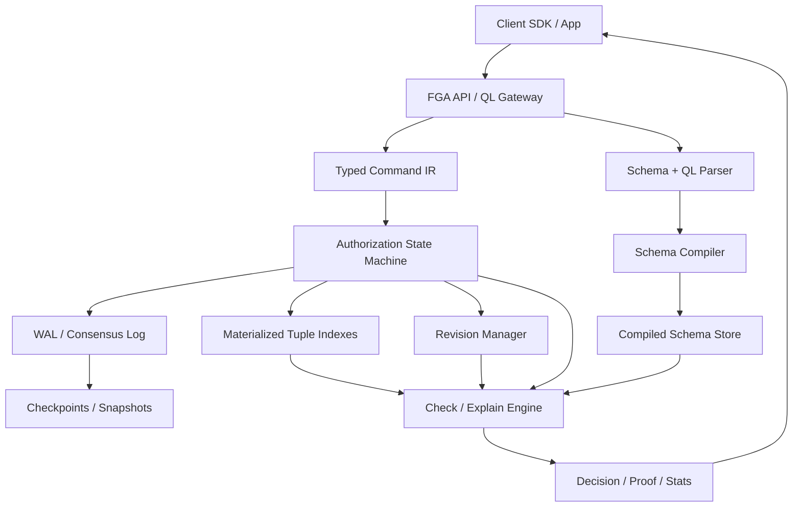

---

## 4. Roadmap Overview

| Phase | Name | Purpose |
|---:|---|---|
| 0 | MVP 1 | Single-node durable engine |
| 1 | Core Authorization Semantics | Add comparison-critical auth operators |
| 2 | Operational Readiness | Make it safe to operate |
| 3 | Domain-Specific QL | Human-friendly command interface |
| 4 | Performance Analysis and Benchmarking | Compare with existing systems |
| 5 | Performance Optimization | Optimize based on measurements |
| 6 | Replication and Consensus | Fault-tolerant replicated log |
| 7 | Distributed Revisions | Strong read-after-write across replicas |
| 8 | Sharding and Multi-Tenant Scale | Scale beyond one write stream |
| 9 | Extended Authorization Semantics | Caveats, wildcards, context |
| 10 | Materialized Authorization | Selective effective permission indexes |
| 11 | Global Distribution | Multi-region operation |
| 12 | Authorization Platform | UI, graph explorer, simulation, tooling |

---

# Phase 0 – MVP 1

## Goal

Build a correct, durable, single-node authorization database.

## Features

- Single-node state machine
- WAL
- Checkpoints
- Relationship tuples
- Native schema DSL
- Explicit `relation`
- Explicit `permission`
- Exists/forward/reverse indexes
- Permission program compiler
- Check engine
- Batch check
- Explain-one
- Revision consistency
- Basic stats

## Architecture

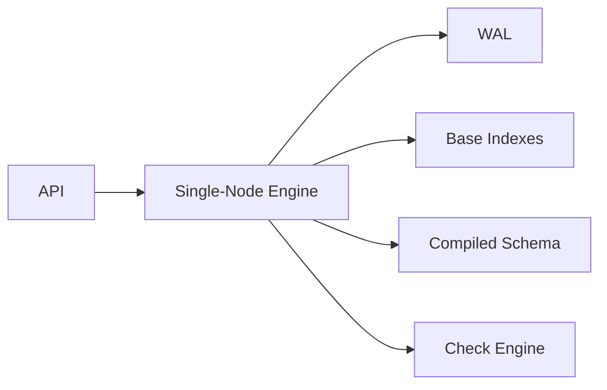

## Outcome

A usable embedded or standalone authorization database.

---

# Phase 1 – Core Authorization Semantics

## Goal

Support the semantic features needed for meaningful comparison against OpenFGA, SpiceDB/Authzed, and Zanzibar-style systems.

## Features

- Union
- Intersection
- Exclusion/difference
- Recursive group membership
- Nested usersets
- Parent inheritance
- Tenant/org admin inheritance
- Permission dependency graph
- Denial explanation summary
- Multi-branch permission evaluation

## Architecture

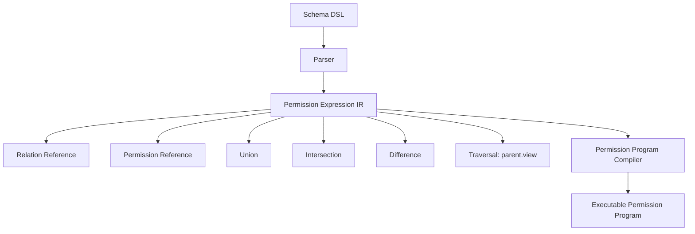

## Outcome

The engine can run realistic FGA benchmarks.

---

# Phase 2 – Operational Readiness

## Goal

Make the engine safe to run.

## Features

- Structured logs
- Metrics
- Slow-check logging
- Health endpoints
- WAL verifier
- Checkpoint verifier
- Backup/restore
- Storage scrubber
- Admin CLI

## Architecture

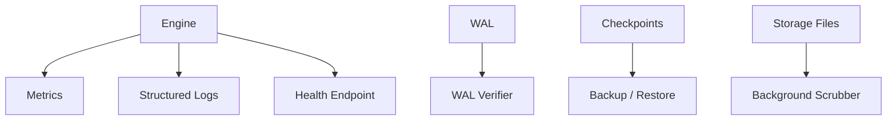

## Outcome

The engine can be operated and debugged.

---

# Phase 3 – Domain-Specific QL

## Goal

Add a human-friendly command language while keeping the engine operation surface narrow.

## Example

```text
WRITE RELATIONSHIP group:eng#member@user:kien;
CHECK user:kien CAN view document:doc1;
EXPLAIN user:kien CAN view document:doc1;
```

## Architecture

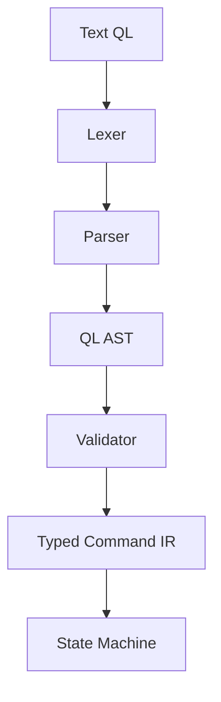

## Rule

QL compiles to fixed commands. It is not an arbitrary graph query language.

## Outcome

Strong developer experience.

---

# Phase 4 – Performance Analysis and Benchmarking

## Goal

Measure the engine against realistic workloads and existing systems.

## Features

- Per-check stats
- Branch-level traces
- Slow-check samples
- High-fanout detection
- Benchmark runner
- Dataset generators
- Comparison workloads
- Explain cost measurement

## Architecture

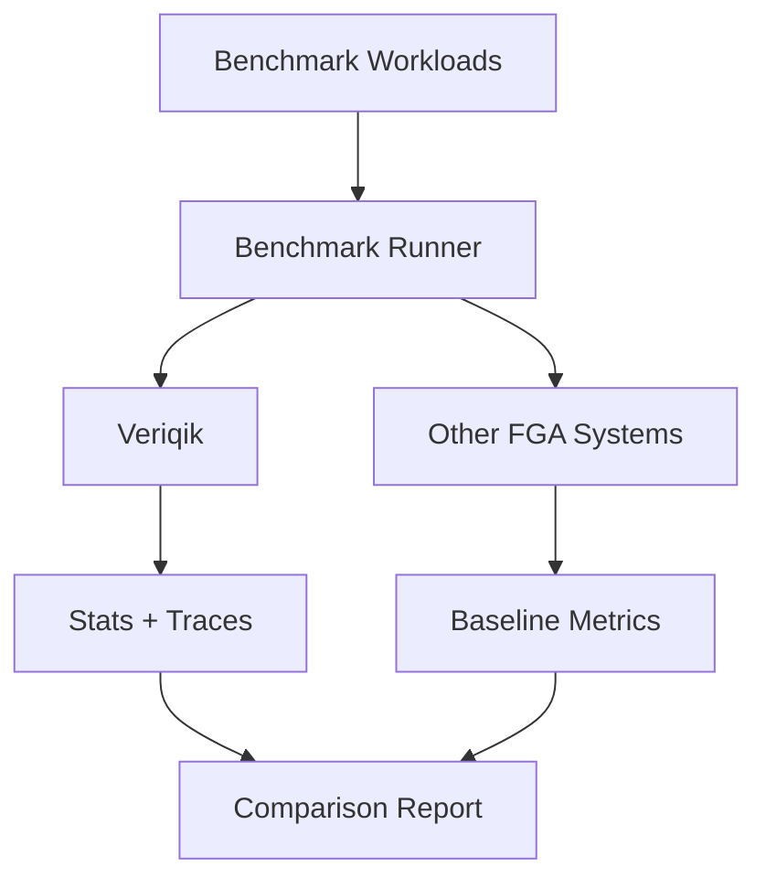

## Benchmark Categories

- Direct checks
- Group checks
- Nested groups
- Parent inheritance
- Tenant admin inheritance
- Intersection
- Exclusion
- Denial checks
- Batch checks
- Explain-one
- High-fanout relations

## Outcome

Evidence-based optimization roadmap.

---

# Phase 5 – Performance Optimization

## Goal

Optimize based on measured bottlenecks.

## Features

- Permission plan ordering
- Fanout statistics
- Revision-aware caches
- Bounded global caches
- Selective group closure
- Witness metadata for explain
- Optimized `lookupObjects`
- Optimized `lookupSubjects`

## Architecture

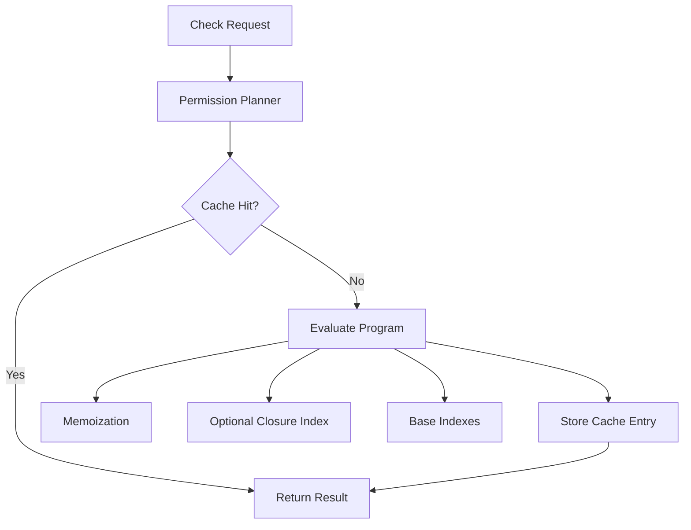

## Outcome

Lower latency for hot workloads.

---

# Phase 6 – Replication and Consensus

## Goal

Make Veriqik fault-tolerant.

## Architecture

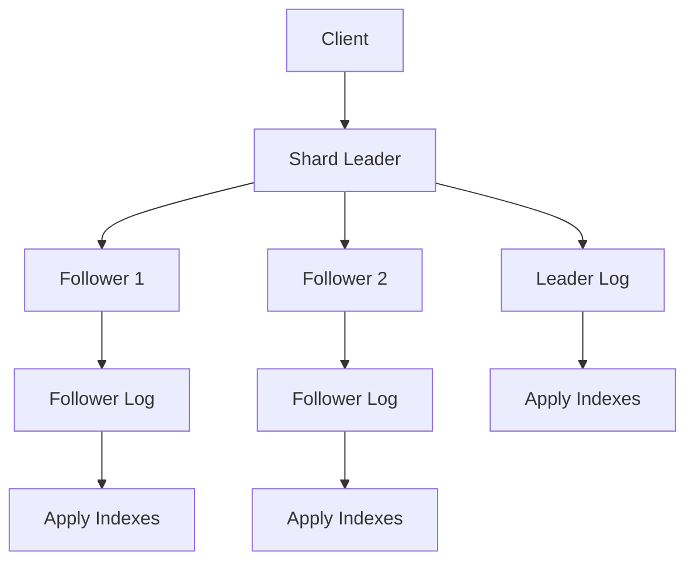

## Write Flow

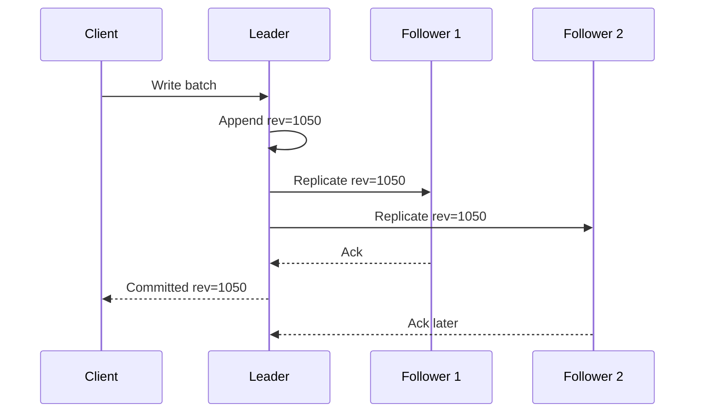

## Outcome

Durable replicated authorization history.

---

# Phase 7 – Distributed Revisions

## Goal

Support read-after-write and read-after-revoke in replicated systems.

## Concepts

- committed revision
- applied revision
- min revision
- revision tokens
- follower reads

## Architecture

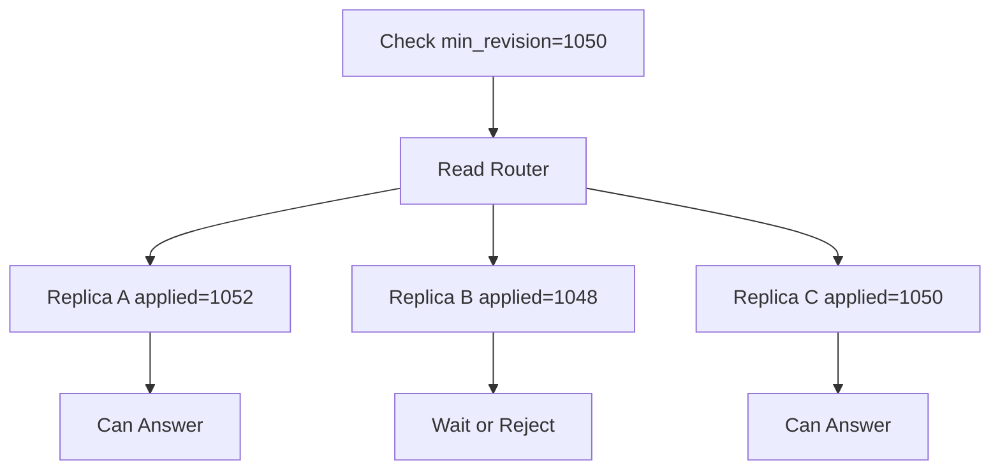

## Outcome

Clients can enforce freshness requirements.

---

# Phase 8 – Sharding and Multi-Tenant Scale

## Goal

Scale beyond one write stream.

## Initial Strategy

Shard by tenant.

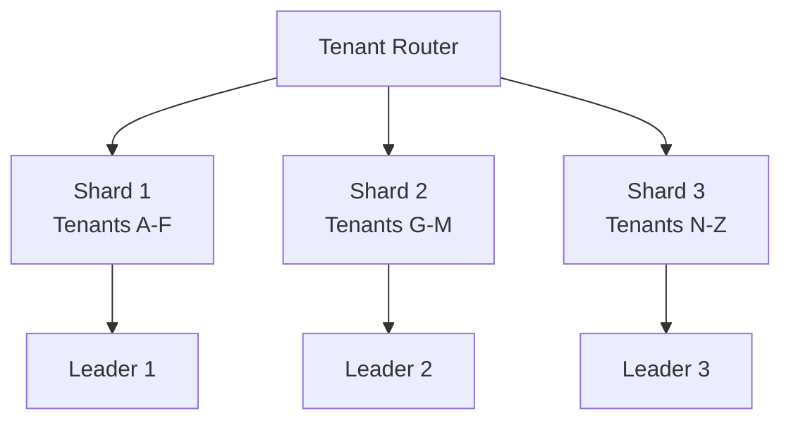

## Later Strategy

For very large tenants, shard by:

- Workspace
- Organization
- Object namespace
- Object ID hash

## Outcome

More write and storage scale.

---

# Phase 9 – Extended Authorization Semantics

## Goal

Add specialized semantics after baseline performance is understood.

## Features

- Wildcards
- Caveats
- Contextual conditions
- Time-bound relationships
- Attribute checks
- Schema migration validation

## Architecture

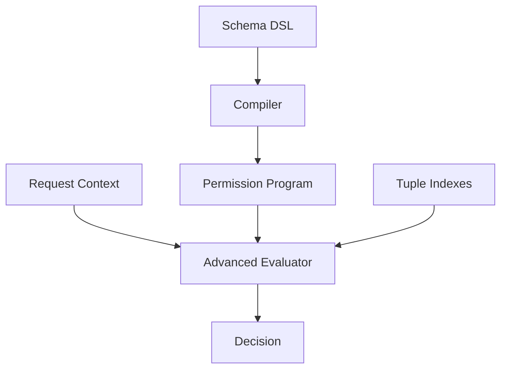

## Outcome

Richer enterprise authorization models.

---

# Phase 10 – Materialized Authorization

## Goal

Make selected hot permissions extremely fast.

## Features

- Effective permission indexes
- Incremental recomputation
- Dependency tracking
- Revocation-safe invalidation
- Witness metadata for explain

## Architecture

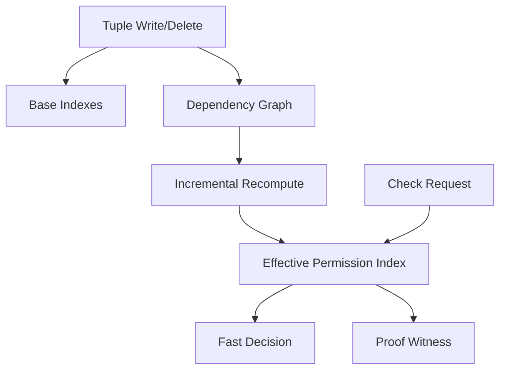

## Warning

Naive materialization can explode:

```text
users × objects × permissions
```

## Outcome

Sub-millisecond checks for selected hot paths.

---

# Phase 11 – Global Distribution

## Goal

Support multi-region operation.

## Features

- Regional replicas
- Geo-aware routing
- Disaster recovery
- Snapshot shipping
- Region failover
- Bounded-staleness modes
- Strong-region mode for sensitive checks

## Architecture

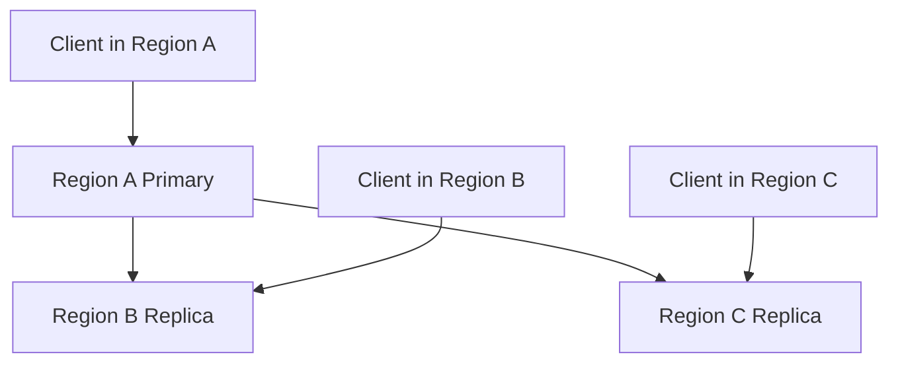

## Outcome

Enterprise-grade availability and disaster recovery.

---

# Phase 12 – Authorization Platform

## Goal

Turn Veriqik into a complete authorization platform.

## Features

- Visual graph explorer
- Explain UI
- Schema migration assistant
- Performance analyzer
- Access simulation
- Audit viewer
- Policy testing
- Workload replay
- IDE support
- SDKs

## Architecture

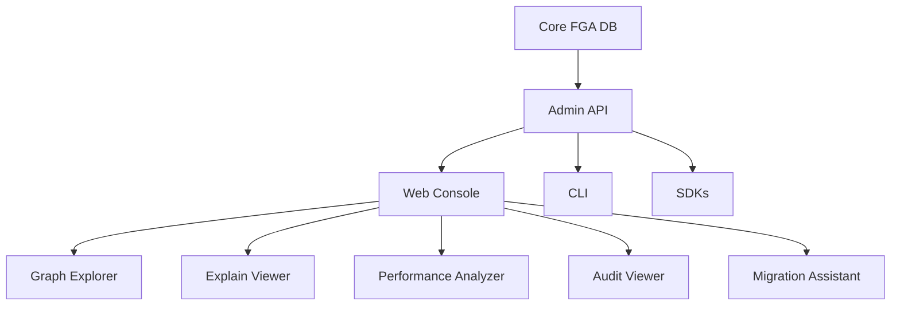

## Outcome

A complete authorization platform.

---

# Revised Build Order

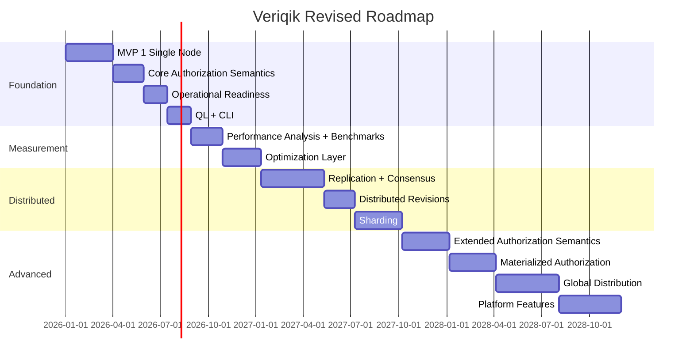

---

# Design Principles

1. Correctness before speed
2. WAL/consensus log is the source of truth
3. Indexes are derived and rebuildable
4. Relations are stored; permissions are compiled
5. Checks target permissions
6. Writes target relations
7. Revisions are part of the API
8. Fail closed when authorization state is uncertain
9. Batch first
10. Explainability is a product feature
11. Keep the operation surface small
12. Implement comparison-critical semantics before serious benchmarking
