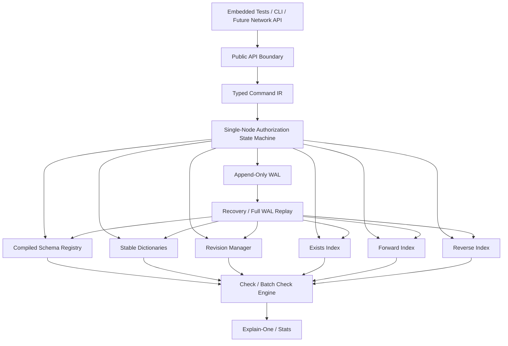

# Veriqik MVP 1 Plan

**Tagline:** A purpose-built database for fine-grained authorization.

**Domain language:** [Veriqik Domain Language](../domain/Domain_Language.md)

## 1. MVP 1 Goal

Build a **single-node, durable, domain-specific FGA/ReBAC database**.

MVP 1 proves the core Veriqik idea:

> Authorization logic, relationship storage, indexing, consistency, and explainability belong in one purpose-built database.

Veriqik is not just a policy engine, tuple service, or library. It is a storage-backed authorization database.

The MVP can start as an embedded engine with a CLI/test harness, as long as every command path is testable. A network API becomes required before load/stress testing against OpenFGA, SpiceDB/Authzed, or other external systems.

---

## 2. Core Design Position

Veriqik uses native schema semantics:

```text
relation = tuple-backed stored relationship
permission = compiled authorization program
```

This is intentionally different from models that treat computed access as just another rewritten relation.

The DSL is Veriqik-native from day one. It is Zanzibar-inspired at the ReBAC model level, but it does not aim for Zanzibar/OpenFGA schema compatibility.

Example:

```text
type document {
  relation viewer: user | group#member
  relation editor: user | group#member
  relation parent: folder

  permission view = viewer + editor + parent.view
  permission edit = editor + parent.edit
}
```

In MVP 1:

- Writes target **relations**
- Checks target **permissions**
- Permissions do not add an extra graph hop by default
- Permissions compile into execution programs over relations and traversals

---

## 3. MVP 1 Scope

### Included

- Single-node engine
- Durable WAL
- Relationship tuple writes/deletes
- Schema DSL
- Compiled permission programs
- Exists index
- Forward index
- Reverse index
- `check`
- `batch_check`
- `explain_one`
- Revision-based consistency
- Cycle detection
- Traversal limits
- Request/batch memoization
- Basic performance stats
- Tenant-scoped data model
- Deterministic replay with stable dictionaries
- Canonical command encoding
- Single-writer/many-reader snapshot consistency
- Explicit health states

### Excluded

- Replication
- Consensus
- Distributed revisions
- Multi-region deployment
- Periodic checkpoints
- Idempotent write retries via request IDs
- Full materialized permissions
- Group closure indexes
- Wildcards
- Caveats/contextual ABAC
- Exact historical reads
- Custom LSM storage
- Optimized `lookupObjects`
- Optimized `lookupSubjects`
- Full graph query language
- Production-grade network API

---

## 4. MVP 1 Architecture



---

## 5. Milestone 1 – Core Types and In-Memory Engine

### Build

- `TenantId`
- `TypeId`
- `ObjectId`
- `RelationId`
- `PermissionId`
- `SubjectKey`
- `ObjectRelationKey`
- `TupleKey`
- Basic in-memory tuple writes/deletes

### Deliverable

An in-memory tuple store with basic index maintenance.

The in-memory engine must already apply commands through a deterministic state-machine boundary so WAL replay later uses the same mutation path.

---

## 6. Milestone 2 – Schema DSL and Compiler

### Build

Support:

- `type`
- `relation`
- `permission`
- allowed subject types
- relation references
- permission references
- union
- traversal via dot syntax, such as `parent.view`

### Example

```text
type user

type group {
  relation member: user | group#member
}

type folder {
  relation viewer: user | group#member
  relation editor: user | group#member

  permission view = viewer + editor
  permission edit = editor
}

type document {
  relation parent: folder
  relation viewer: user | group#member
  relation editor: user | group#member

  permission view = viewer + editor + parent.view
  permission edit = editor + parent.edit
}
```

### Deliverable

Parsed and compiled schema representation.

---

## 7. Milestone 3 – Base Indexes

### Build

- Exists index: `TupleKey -> TupleMeta`
- Forward index: `ObjectRelationKey -> SubjectSet`
- Reverse index: `SubjectKey -> ObjectRelationSet`

### Deliverable

Indexes stay consistent after tuple writes/deletes.

---

## 8. Milestone 4 – Check Engine

### Build

- Permission program evaluation
- Internal relation evaluation
- Userset subject expansion
- Parent/resource traversal
- Nested group traversal
- Cycle detection
- Traversal limits
- Request-local memoization

### Deliverable

`check(subject, object, permission)` works for direct and indirect ReBAC paths.

---

## 9. Milestone 5 – Batch Check

### Build

- Batch-level evaluated revision
- Shared batch memoization
- Per-item result

### Deliverable

Efficient batch authorization checks.

---

## 10. Milestone 6 – Explain-One

### Build

- Parent pointer tracking
- Proof path reconstruction
- Tuple proof events
- Permission branch proof events

### Deliverable

One human-readable proof path for successful checks.

---

## 11. Milestone 7 – WAL and Recovery

### Build

- Append-only WAL
- Checksummed records
- One revision per command batch
- Canonical command payloads
- Logged dictionary allocations
- Logged schema versions
- Replay on startup
- Truncated-tail recovery

### Deliverable

Writes survive restart.

---

## 12. Milestone 8 – API and CLI/QL

### Build

Core API:

- `write_schema`
- `write_relationships`
- `delete_relationships`
- `check`
- `batch_check`
- `explain_one`
- `health`
- `current_revision`

Initial transport:

- Embedded API for tests
- CLI command runner for local usage
- Network API before comparative load/stress testing

Optional QL:

```text
WRITE RELATIONSHIP group:eng#member@user:kien;
CHECK user:kien CAN view document:doc1;
EXPLAIN user:kien CAN view document:doc1;
```

### Deliverable

Usable local Veriqik engine via embedded API and CLI, with a network transport added before comparative benchmarking.

---

## 13. Milestone 9 – Stats and Test Harness

### Build

- `nodes_visited`
- `edges_scanned`
- `index_lookups`
- `memo_hits`
- `memo_misses`
- `max_depth`
- `elapsed_ns`
- failed-closed status counts
- health state transitions

### Deliverable

Early performance visibility.

---

## 15. MVP 1 Success Demo

The MVP should support this end-to-end flow:

```text
1. Start Veriqik.
2. Write schema.
3. Add Kien to group eng.
4. Grant group eng viewer on doc1.
5. Check Kien can view doc1.
6. Explain why.
7. Restart Veriqik.
8. Check again.
9. Delete group membership.
10. Check Kien can no longer view doc1.
```

---

## 16. MVP 1 Acceptance Criteria

MVP 1 is complete when:

- Direct permission checks work
- Group-based permission checks work
- Nested group checks work
- Parent inheritance checks work
- Tenant/admin inheritance checks work
- Revocation works with revision consistency
- Cycles terminate safely
- WAL recovery works
- Explain-one produces a valid proof
- Batch check shares memoized subproblems
- Invalid tuples are rejected by schema validation
- Public checks reject relation targets
- Failed-closed results are distinguishable from denial
- Canonical command hashing is deterministic
- Checks and batch checks observe stable evaluated revisions

---

## 17. MVP 1 Non-Negotiable Invariants

- WAL is the source of truth
- Indexes are derived and rebuildable
- Permissions are compiled programs, not stored edges
- Writes target relations
- Checks target permissions
- Schema and dictionary changes are logged state-machine changes
- Canonical command encoding is deterministic
- A committed batch is atomic
- Revisions are monotonic
- Traversal is bounded
- Authorization uncertainty fails closed and is distinguishable from clean denial
