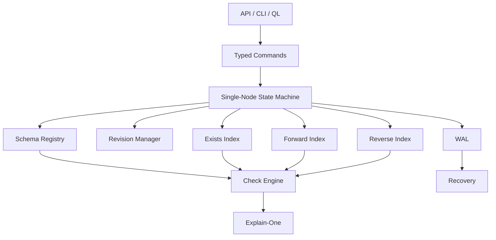

# Veriqik MVP 1 Technical Specification

**Tagline:** A purpose-built database for fine-grained authorization.

## 1. Purpose

MVP 1 defines the first implementable version of Veriqik: a single-node durable authorization database for FGA/ReBAC.

It should prove:

- Relationship tuples can be stored durably
- Authorization schemas can be compiled
- Permissions can be evaluated efficiently
- Indirect ReBAC relationships work
- Checks are revision-aware
- Explanations can be produced
- The system can recover after restart

---

## 2. Core Semantic Model

Veriqik separates **relations** from **permissions**.

```text
relation = tuple-backed stored relationship
permission = compiled computed authorization program
```

Example:

```text
type document {
  relation viewer: user | group#member
  relation editor: user | group#member
  relation parent: folder

  permission view = viewer + editor + parent.view
  permission edit = editor + parent.edit
}
```

### Important Rule

`permission` does **not** create an additional graph hop by default.

This:

```text
permission view = viewer
```

compiles to:

```text
evaluate relation viewer
```

not:

```text
document#view -> document#viewer -> user
```

Permissions are execution entry points and planning/indexing units.

---

## 3. MVP 1 Scope

### In Scope

- Single-node engine
- Durable WAL
- Checkpoints
- Tuple writes/deletes
- Schema DSL
- Compiled permission programs
- Exists index
- Forward index
- Reverse index
- Check API
- Batch check API
- Explain-one API
- Revision consistency
- Cycle detection
- Traversal limits
- Memoization
- Basic stats

### Out of Scope

- Replication
- Consensus
- Multi-region deployment
- Exact historical reads
- Materialized permissions
- Group closure indexes
- Wildcards
- Caveats
- ABAC/contextual conditions
- Custom LSM
- Full graph QL

---

## 4. Architecture



---

## 5. Human Data Format

### Object

```text
<type>:<id>
```

Examples:

```text
user:kien
group:eng
document:doc1
folder:f1
tenant:acme
```

### Object Relation

```text
<object>#<relation>
```

Examples:

```text
document:doc1#viewer
group:eng#member
```

### Tuple

```text
<object>#<relation>@<subject>
```

Examples:

```text
document:doc1#viewer@user:kien
document:doc1#viewer@group:eng#member
group:eng#member@user:kien
```

---

## 6. Internal Keys

### TupleKey

```zig
const TupleKey = struct {
    tenant_id: u64,

    object_type_id: u32,
    object_id: u128,

    relation_id: u32,

    subject_type_id: u32,
    subject_id: u128,
    subject_relation_id: u32, // 0 = no relation
};
```

### ObjectRelationKey

```zig
const ObjectRelationKey = struct {
    tenant_id: u64,
    object_type_id: u32,
    object_id: u128,
    relation_id: u32,
};
```

### SubjectKey

```zig
const SubjectKey = struct {
    tenant_id: u64,
    subject_type_id: u32,
    subject_id: u128,
    subject_relation_id: u32, // 0 = direct subject
};
```

---

## 7. Tenant Model

Every tuple includes `tenant_id`.

MVP 1 rules:

- One tuple belongs to exactly one tenant
- Checks are tenant-scoped
- Cross-tenant relationships are rejected
- Single-tenant mode uses `tenant_id = 1`

---

## 8. Schema DSL

### Example

```text
type user

type group {
  relation member: user | group#member
}

type tenant {
  relation admin_member: user | group#member
  permission admin = admin_member
}

type folder {
  relation tenant: tenant
  relation viewer: user | group#member
  relation editor: user | group#member

  permission view = viewer + editor + tenant.admin
  permission edit = editor + tenant.admin
}

type document {
  relation parent: folder
  relation viewer: user | group#member
  relation editor: user | group#member

  permission view = viewer + editor + parent.view
  permission edit = editor + parent.edit
}
```

### MVP Operators

| Operator | Example | Meaning |
|---|---|---|
| relation ref | `viewer` | Evaluate local relation |
| permission ref | `view` | Evaluate local permission |
| union | `viewer + editor` | OR |
| traversal | `parent.view` | Follow relation, evaluate target permission |

### Planned Early Operators

These should be supported soon after the core MVP because they are needed for performance comparison:

| Operator | Example | Meaning |
|---|---|---|
| intersection | `viewer & employee` | AND |
| exclusion | `viewer - banned` | allow minus deny set |

---

## 9. Schema IR

### Definitions

```zig
const RelationDef = struct {
    name_id: u32,
    allowed_subjects: []AllowedSubjectType,
};

const PermissionDef = struct {
    name_id: u32,
    expr: ExprId,
};
```

### Expression IR

```zig
const PermissionExpr = union(enum) {
    relation: RelationId,
    permission: PermissionId,

    union_: []ExprId,
    intersection: []ExprId,
    difference: DifferenceExpr,

    traversal: TraversalExpr,
};
```

### Traversal

```zig
const TraversalExpr = struct {
    relation: RelationId,
    target_permission: PermissionId,
};
```

Example:

```text
permission view = viewer + parent.view
```

compiles to:

```text
Union(
  Relation(viewer),
  Traversal(parent, view)
)
```

---

## 10. Write and Check Rules

### Writes Target Relations

Valid:

```text
WRITE document:doc1#viewer@user:kien
WRITE group:eng#member@user:kien
WRITE document:doc1#parent@folder:f1
```

Invalid by default:

```text
WRITE document:doc1#view@user:kien
```

because `view` is a permission, not a relation.

### Checks Target Permissions

Preferred:

```text
CHECK user:kien CAN view document:doc1
```

Optional debug-only relation check can be added later:

```text
CHECK_RELATION user:kien IN document:doc1#viewer
```

---

## 11. Commands

### WriteSchema

```zig
const WriteSchemaCommand = struct {
    tenant_id: u64,
    schema_text: []const u8,
    expected_schema_version: ?u64,
    request_id: ?RequestId,
};
```

### WriteRelationships

```zig
const WriteRelationshipsCommand = struct {
    tenant_id: u64,
    writes: []TupleKey,
    preconditions: []Precondition,
    expected_schema_version: ?u64,
    request_id: ?RequestId,
};
```

### DeleteRelationships

```zig
const DeleteRelationshipsCommand = struct {
    tenant_id: u64,
    deletes: []TupleKey,
    preconditions: []Precondition,
    expected_schema_version: ?u64,
    request_id: ?RequestId,
};
```

### Preconditions

```zig
const Precondition = union(enum) {
    must_exist: TupleKey,
    must_not_exist: TupleKey,
};
```

---

## 12. Revision Model

MVP 1 uses a single monotonic revision counter.

```zig
current_revision: u64
```

Every successful write batch gets one revision.

### Consistency Modes

```zig
const Consistency = union(enum) {
    latest,
    at_least: u64,
};
```

### Rules

- `latest`: read current applied state
- `at_least N`: answer if `N <= current_revision`
- if `N > current_revision`, return `REVISION_NOT_AVAILABLE`
- exact historical reads are deferred

---

## 13. Storage

MVP 1 storage:

```text
WAL + in-memory indexes + periodic checkpoints
```

### WAL Record

```text
magic
format_version
record_length
revision
command_type
payload
checksum
```

### Safe Write Path

```text
1. Parse command
2. Validate schema
3. Validate preconditions
4. Assign revision
5. Encode WAL record
6. Append WAL record
7. fsync / group commit
8. Apply to indexes
9. Publish current_revision
10. Return success
```

### Failure Rule

If append/fsync fails:

- Do not publish revision
- Do not return success
- Mark storage unhealthy or read-only

---

## 14. Recovery

Startup:

```text
1. Load latest valid checkpoint if present
2. Replay WAL records after checkpoint
3. Verify checksum and revision order
4. Stop at first incomplete tail record
5. Truncate invalid tail if safe
6. Rebuild indexes
```

Middle corruption is fatal until restored or repaired.

---

## 15. Checkpoints

Checkpoint contains:

- current revision
- schema registry
- dictionaries
- exists index
- forward index
- reverse index

Safe checkpoint write:

```text
1. write checkpoint_N.tmp
2. fsync file
3. rename to checkpoint_N.snapshot
4. fsync directory
5. keep last 2 or 3 checkpoints
```

---

## 16. Indexes

### Exists Index

```zig
exists: HashMap(TupleKey, TupleMeta)
```

Used for:

- duplicate detection
- direct tuple lookup
- delete validation

### Forward Index

```zig
forward: HashMap(ObjectRelationKey, SubjectSet)
```

Used for main traversal.

Example:

```text
document:doc1#viewer -> [user:kien, group:eng#member]
```

### Reverse Index

```zig
reverse: HashMap(SubjectKey, ObjectRelationSet)
```

Used for future lookup, invalidation, and debugging.

---

## 17. Check API

### Command

```zig
const CheckCommand = struct {
    tenant_id: u64,
    subject: SubjectKey,
    object_type_id: u32,
    object_id: u128,
    permission_id: u32,
    consistency: Consistency,
    limits: CheckLimits,
};
```

### Result

```zig
const CheckResult = struct {
    allowed: bool,
    evaluated_revision: u64,
    schema_version: u64,
    stats: CheckStats,
};
```

---

## 18. Check Algorithm

Conceptual function:

```text
check(subject, object, permission)
```

Flow:

```text
1. Load compiled permission expression.
2. Evaluate expression.
3. For relation references, inspect forward index.
4. For userset subjects, recursively check subject membership.
5. For traversal, follow relation then evaluate target permission.
6. Stop on first success.
7. Use visited set to avoid cycles.
8. Use memo cache to avoid repeated subproblems.
```

### Relation Reference

For:

```text
viewer
```

evaluate:

```text
forward[document:doc1#viewer]
```

### Userset Subject

For:

```text
document:doc1#viewer@group:eng#member
```

evaluate:

```text
check(user:kien, group:eng, member)
```

### Traversal

For:

```text
parent.view
```

evaluate:

```text
1. forward[document:doc1#parent] -> folder:f1
2. check(user:kien, folder:f1, view)
```

---

## 19. Cycle Detection

Use:

```zig
const CheckState = struct {
    subject: SubjectKey,
    object_type_id: u32,
    object_id: u128,
    permission_or_relation_id: u32,
};
```

If a state is already visited, return false for that branch.

---

## 20. Memoization

Use request-local and batch-local memoization.

```zig
const MemoKey = struct {
    revision: u64,
    subject: SubjectKey,
    object_type_id: u32,
    object_id: u128,
    permission_or_relation_id: u32,
};
```

Memo values:

```zig
const MemoValue = enum {
    allowed,
    denied,
};
```

No global cache in MVP 1.

---

## 21. Traversal Limits

```zig
const CheckLimits = struct {
    max_depth: u32 = 32,
    max_nodes_visited: u64 = 100_000,
    max_edges_scanned: u64 = 1_000_000,
};
```

Errors:

- `CHECK_DEPTH_EXCEEDED`
- `CHECK_NODE_LIMIT_EXCEEDED`
- `CHECK_EDGE_LIMIT_EXCEEDED`

---

## 22. Explain-One

`explain_one` returns one successful proof path.

Implementation:

- Use same traversal as check
- Record parent pointers
- Reconstruct path on success

Example:

```json
{
  "allowed": true,
  "revision": 1050,
  "proof": [
    {
      "kind": "permission",
      "target": "document:doc1#view",
      "rule": "viewer + parent.view"
    },
    {
      "kind": "tuple",
      "tuple": "document:doc1#parent@folder:f1"
    },
    {
      "kind": "tuple",
      "tuple": "folder:f1#viewer@group:eng#member"
    },
    {
      "kind": "tuple",
      "tuple": "group:eng#member@user:kien"
    }
  ]
}
```

No `explain_all` in MVP 1.

---

## 23. Batch Check

Batch checks should share one evaluated revision and one memo cache.

```zig
const BatchCheckCommand = struct {
    tenant_id: u64,
    checks: []CheckCommandItem,
    consistency: Consistency,
    limits: CheckLimits,
};
```

Result:

```zig
const BatchCheckResult = struct {
    evaluated_revision: u64,
    results: []CheckResultItem,
    stats: BatchStats,
};
```

---

## 24. Performance Stats

```zig
const CheckStats = struct {
    nodes_visited: u64,
    edges_scanned: u64,
    index_lookups: u64,
    memo_hits: u64,
    memo_misses: u64,
    max_depth_reached: u32,
    elapsed_ns: u64,
};
```

---

## 25. Public API

MVP operations:

- `write_schema`
- `write_relationships`
- `delete_relationships`
- `check`
- `batch_check`
- `explain_one`
- `health`
- `current_revision`

---

## 26. Optional QL

Example:

```text
WRITE RELATIONSHIP group:eng#member@user:kien;
WRITE RELATIONSHIP document:doc1#viewer@group:eng#member;

CHECK user:kien CAN view document:doc1;
EXPLAIN user:kien CAN view document:doc1;
```

QL compiles to typed commands.

---

## 27. Error Model

MVP errors:

```text
INVALID_SCHEMA
UNKNOWN_TYPE
UNKNOWN_RELATION
UNKNOWN_PERMISSION
INVALID_SUBJECT_TYPE
TUPLE_ALREADY_EXISTS
TUPLE_NOT_FOUND
PRECONDITION_FAILED
TENANT_MISMATCH
REVISION_NOT_AVAILABLE
CHECK_DEPTH_EXCEEDED
CHECK_NODE_LIMIT_EXCEEDED
CHECK_EDGE_LIMIT_EXCEEDED
WAL_APPEND_FAILED
WAL_FSYNC_FAILED
WAL_CORRUPT
CHECKPOINT_CORRUPT
AUTHZ_STATE_UNAVAILABLE
```

Authorization uncertainty fails closed.

---

## 28. Correctness Invariants

### Tuple/index consistency

For every tuple in `exists`:

```text
subject appears in forward[object#relation]
object#relation appears in reverse[subject]
```

### No invalid tuple

Every tuple must satisfy active schema.

### Atomic batch

A write batch is fully visible or not visible.

### Monotonic revision

```text
next_revision = current_revision + 1
```

### No cross-tenant edges

Rejected in MVP 1.

### Deterministic replay

Same WAL produces same state.

---

## 29. Acceptance Tests

### Direct Permission

```text
type user

type document {
  relation viewer: user
  permission view = viewer
}
```

Tuple:

```text
document:doc1#viewer@user:kien
```

Expected:

```text
CHECK user:kien CAN view document:doc1 => true
```

### Group Permission

```text
type user

type group {
  relation member: user
}

type document {
  relation viewer: user | group#member
  permission view = viewer
}
```

Tuples:

```text
document:doc1#viewer@group:eng#member
group:eng#member@user:kien
```

Expected:

```text
CHECK user:kien CAN view document:doc1 => true
```

### Parent Inheritance

```text
type user

type folder {
  relation editor: user
  permission edit = editor
}

type document {
  relation parent: folder
  relation editor: user
  permission edit = editor + parent.edit
}
```

Tuples:

```text
document:doc1#parent@folder:f1
folder:f1#editor@user:kien
```

Expected:

```text
CHECK user:kien CAN edit document:doc1 => true
```

### Nested Groups

```text
document:doc1#viewer@group:company#member
group:company#member@group:eng#member
group:eng#member@user:kien
```

Expected:

```text
CHECK user:kien CAN view document:doc1 => true
```

### Revocation

```text
WRITE document:doc1#viewer@user:kien => rev 10
CHECK at_least 10 => true

DELETE document:doc1#viewer@user:kien => rev 11
CHECK at_least 11 => false
```

### Cycle Safety

```text
group:a#member@group:b#member
group:b#member@group:a#member
```

Expected:

```text
CHECK terminates
```

### Recovery

```text
write tuples
restart engine
checks still pass
```

### Partial WAL Tail

```text
write valid WAL records
append partial/corrupt record
restart
engine recovers up to last valid revision
```

---

## 30. Zig Module Layout

```text
src/
  main.zig

  core/
    ids.zig
    tuple.zig
    keys.zig
    revision.zig
    errors.zig

  schema/
    lexer.zig
    parser.zig
    ast.zig
    compiler.zig
    expr.zig
    registry.zig

  storage/
    wal.zig
    wal_codec.zig
    checkpoint.zig
    checksum.zig
    recovery.zig

  index/
    exists.zig
    forward.zig
    reverse.zig
    dictionary.zig

  engine/
    state_machine.zig
    write.zig
    delete.zig
    check.zig
    batch_check.zig
    explain.zig
    stats.zig

  api/
    json.zig
    server.zig

  ql/
    lexer.zig
    parser.zig
    commands.zig

  tests/
    direct_access_test.zig
    group_access_test.zig
    nested_group_test.zig
    parent_inheritance_test.zig
    recovery_test.zig
    wal_corruption_test.zig
```

---

## 31. Build Order

1. In-memory tuple engine
2. Schema compiler
3. Base indexes
4. Check traversal
5. Explain-one
6. Batch check
7. WAL
8. Recovery
9. Checkpoints
10. API/QL
11. Stats
12. Acceptance tests

---

## 32. MVP 1 Success Criteria

MVP 1 is successful when:

```text
1. It can load a Veriqik-native schema.
2. It can durably write/delete relation tuples.
3. It can recover from restart.
4. It can answer direct permission checks.
5. It can answer indirect group checks.
6. It can answer nested group checks.
7. It can answer parent inheritance checks.
8. It can explain one successful proof path.
9. It prevents infinite traversal from cycles.
10. It supports revision-aware read-after-write.
```
