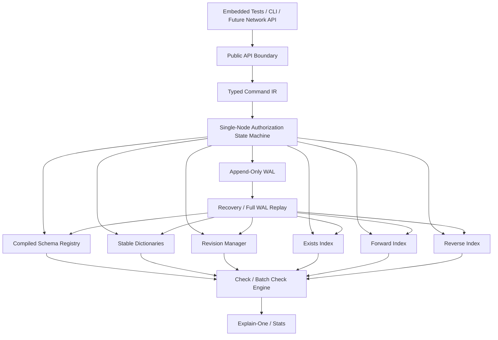

# Veriqik MVP 1 Technical Specification

**Tagline:** A purpose-built database for fine-grained authorization.

**Domain language:** [Veriqik Domain Language](../domain/Domain_Language.md)

**Normative language:** `MUST` means required for correctness or compatibility. `SHOULD` means expected unless there is a documented reason not to. `MAY` means optional behavior.

## 1. Purpose

MVP 1 defines the first implementable version of Veriqik: a single-node durable authorization database for FGA/ReBAC.

It should prove:

- Relationship tuples can be stored durably
- Authorization schemas can be compiled
- Permissions can be evaluated efficiently
- Indirect ReBAC relationships work
- Checks are revision-aware
- Explanations can be produced
- The system can recover after restart

---

## 2. Core Semantic Model

Veriqik separates **relations** from **permissions**.

```text
relation = tuple-backed stored relationship
permission = compiled computed authorization program
```

Example:

```text
type document {
  relation viewer: user | group#member
  relation editor: user | group#member
  relation parent: folder

  permission view = viewer + editor + parent.view
  permission edit = editor + parent.edit
}
```

### Important Rule

`permission` does **not** create an additional graph hop by default.

This:

```text
permission view = viewer
```

compiles to:

```text
evaluate relation viewer
```

not:

```text
document#view -> document#viewer -> user
```

Permissions are execution entry points and planning/indexing units.

---

## 3. MVP 1 Scope

The [MVP 1 Plan](../plans/MVP1.md) owns product scope and milestone order. This section summarizes the technical surface constrained by this specification.

### In Scope

- Single-node engine
- Durable WAL
- Tuple writes/deletes
- Schema DSL
- Compiled permission programs
- Exists index
- Forward index
- Reverse index
- Check API
- Batch check API
- Explain-one API
- Embedded test harness and CLI command runner
- Revision consistency
- Cycle detection
- Traversal limits
- Memoization
- Basic stats

### Out of Scope

- Replication
- Consensus
- Multi-region deployment
- Exact historical reads
- Materialized permissions
- Group closure indexes
- Wildcards
- Caveats
- ABAC/contextual conditions
- Custom LSM
- Production network protocol
- Full graph QL
- Periodic checkpoints
- Request-id based write idempotency

---

## 4. Architecture



---

## 4.1 Database Design Model

Veriqik is a domain-specific database, not a policy library wrapped around a generic store.

MVP 1 follows these database rules:

- A small fixed command set mutates state.
- Commands are validated before they enter the durable log.
- The WAL is the source of truth.
- All indexes are derived from logged state and are rebuildable.
- Replay of the same WAL must produce the same schema registry, dictionaries, indexes, and revision.
- Checks are bounded computations over a published revision.
- Authorization uncertainty fails closed and is reported separately from a clean denial.
- The initial transport can be embedded tests and CLI; a network API is required before load/stress comparisons with external products.

---

## 5. Human Data Format

### Object

```text
<type>:<id>
```

Examples:

```text
user:kien
group:eng
document:doc1
folder:f1
tenant:acme
```

### Object Relation

```text
<object>#<relation>
```

Examples:

```text
document:doc1#viewer
group:eng#member
```

### Tuple

```text
<object>#<relation>@<subject>
```

Examples:

```text
document:doc1#viewer@user:kien
document:doc1#viewer@group:eng#member
group:eng#member@user:kien
```

---

## 6. Internal Keys

### TupleKey

```zig
const TupleKey = struct {
    tenant_id: u64,

    object_type_id: u32,
    object_id: u128,

    relation_id: u32,

    subject_type_id: u32,
    subject_id: u128,
    subject_relation_id: u32, // 0 = no relation
};
```

### ObjectRelationKey

```zig
const ObjectRelationKey = struct {
    tenant_id: u64,
    object_type_id: u32,
    object_id: u128,
    relation_id: u32,
};
```

### SubjectKey

```zig
const SubjectKey = struct {
    tenant_id: u64,
    subject_type_id: u32,
    subject_id: u128,
    subject_relation_id: u32, // 0 = direct subject
};
```

### Dictionaries and Stable IDs

Human names are mapped to numeric IDs by tenant-scoped dictionaries:

```zig
const DictionaryKind = enum {
    type_name,
    relation_name,
    permission_name,
    object_id,
};
```

Dictionary allocations are state-machine operations and must be represented in the WAL payload of the command that first needs them.

Rules:

- ID `0` is reserved where a nullable relation is needed, such as `subject_relation_id = 0`.
- A name maps to the same numeric ID for the lifetime of the tenant.
- IDs are never reused in MVP 1, even if a later schema removes a type, relation, or permission.
- Recovery must not allocate IDs by parsing in-memory state differently; it replays logged dictionary allocations.
- Future checkpoints must persist dictionaries as part of state, but MVP 1 recovery replays the WAL as the authoritative source.

---

## 7. Tenant Model

Every tuple includes `tenant_id`.

MVP 1 rules:

- One tuple belongs to exactly one tenant
- Checks are tenant-scoped
- Cross-tenant relationships are rejected
- Single-tenant mode uses `tenant_id = 1`

---

## 8. Schema DSL

Veriqik uses its own DSL from day one. It is inspired by Zanzibar-style ReBAC, but it is not Zanzibar/OpenFGA-compatible syntax.

The DSL intentionally distinguishes:

- `relation`: a stored edge that can appear in tuples
- `permission`: a compiled program that can be checked and explained

### Example

```text
type user

type group {
  relation member: user | group#member
}

type tenant {
  relation admin_member: user | group#member
  permission admin = admin_member
}

type folder {
  relation tenant: tenant
  relation viewer: user | group#member
  relation editor: user | group#member

  permission view = viewer + editor + tenant.admin
  permission edit = editor + tenant.admin
}

type document {
  relation parent: folder
  relation viewer: user | group#member
  relation editor: user | group#member

  permission view = viewer + editor + parent.view
  permission edit = editor + parent.edit
}
```

### MVP Operators

| Operator | Example | Meaning |
|---|---|---|
| relation ref | `viewer` | Evaluate local relation |
| permission ref | `view` | Evaluate local permission |
| union | `viewer + editor` | OR |
| traversal | `parent.view` | Follow relation, evaluate target permission |

### MVP Grammar Rules

MVP 1 keeps the schema grammar small and deterministic.

Lexical rules:

- Source text is UTF-8, but identifiers are ASCII-only in MVP 1.
- Identifiers match `[A-Za-z_][A-Za-z0-9_]*`.
- Reserved words are `type`, `relation`, and `permission`.
- Whitespace is insignificant outside identifiers.
- Line comments start with `//` and continue to the end of the line.
- Block comments are not supported in MVP 1.

Definition rules:

- A type may be declared as `type user` or `type document { ... }`.
- Type names are unique within a tenant schema.
- Relation names are unique within a type.
- Permission names are unique within a type.
- A relation and permission may not share the same name within one type.
- Forward references to types are allowed.
- Forward references to relations and permissions are allowed only within the same schema write and must resolve during compilation.
- Duplicate definitions are rejected.

Expression rules:

- Parentheses are not supported in MVP 1.
- `.` binds tighter than `+`.
- `+` is left-associative.
- `viewer + editor + parent.view` parses as `Union(viewer, editor, Traversal(parent, view))`.
- Intersections and exclusions are planned early operators, but are rejected by the MVP 1 compiler until implemented.

### Schema Validation Rules

Compiler validation must reject ambiguous or unsafe schemas before they enter the WAL.

Rules:

- A relation reference must resolve to a relation on the current type.
- A permission reference must resolve to a permission on the current type.
- Public checks can target permissions only.
- A traversal `relation.permission` is valid only when `relation` allows concrete object subjects, not userset subjects.
- For `parent.view`, every concrete object type allowed by `parent` must define permission `view`.
- If a traversal relation allows more than one concrete object type, all target types must define the target permission with compatible semantics at compile time.
- Userset subjects such as `group#member` are allowed only when `member` is a relation on `group`.
- Recursive relation membership and recursive permission evaluation are allowed, but runtime traversal limits and cycle detection must bound them.
- A permission dependency cycle is allowed only if evaluation remains monotonic under MVP 1 operators. Since MVP 1 supports union and traversal only, cycles terminate through visited-state detection and fail closed for repeated branches.
- A relation's allowed subject list must be non-empty.

### Planned Early Operators

These should be supported soon after the core MVP because they are needed for performance comparison:

| Operator | Example | Meaning |
|---|---|---|
| intersection | `viewer & employee` | AND |
| exclusion | `viewer - banned` | allow minus deny set |

---

### Schema Versioning and Compatibility

Each successful `write_schema` creates a new schema version and a new database revision.

Rules:

- Schema versions are tenant-scoped and monotonic.
- Checks evaluate against the schema version active at the evaluated revision.
- MVP 1 does not support exact historical tuple reads, but the current state must still have a single active schema version.
- A schema write is rejected if any existing tuple would become invalid under the new schema.
- Renaming a type, relation, or permission is treated as remove plus add and is rejected if existing tuples still depend on the removed relation/type.
- Removing a permission is allowed only if no remaining permission expression depends on it; existing tuples are unaffected because tuples target relations only.
- Changing a relation's allowed subject types is allowed only if all existing tuples for that relation still validate.
- Relation and permission IDs remain stable; removed names are tombstoned and their IDs are not reused.

Schema validation must build a compatibility report before appending the schema command to the WAL.

---

## 9. Schema IR

### Definitions

```zig
const RelationDef = struct {
    name_id: u32,
    allowed_subjects: []AllowedSubjectType,
};

const PermissionDef = struct {
    name_id: u32,
    expr: ExprId,
};
```

### Expression IR

```zig
const PermissionExpr = union(enum) {
    relation: RelationId,
    permission: PermissionId,

    union_: []ExprId,
    intersection: []ExprId,
    difference: DifferenceExpr,

    traversal: TraversalExpr,
};
```

### Traversal

```zig
const TraversalExpr = struct {
    relation: RelationId,
    target_permission: PermissionId,
};
```

Example:

```text
permission view = viewer + parent.view
```

compiles to:

```text
Union(
  Relation(viewer),
  Traversal(parent, view)
)
```

---

## 10. Write and Check Rules

### Writes Target Relations

Valid:

```text
WRITE document:doc1#viewer@user:kien
WRITE group:eng#member@user:kien
WRITE document:doc1#parent@folder:f1
```

Invalid by default:

```text
WRITE document:doc1#view@user:kien
```

because `view` is a permission, not a relation.

### Checks Target Permissions

Public API:

```text
CHECK user:kien CAN view document:doc1
```

Public `check` accepts permissions only. It must reject relation names, even when a relation and permission have similar names.

Internal/debug tooling may expose relation evaluation later, but it is not part of the stable public API:

```text
CHECK_RELATION user:kien IN document:doc1#viewer
```

---

## 11. Commands

### WriteSchema

```zig
const WriteSchemaCommand = struct {
    tenant_id: u64,
    schema_text: []const u8,
    expected_schema_version: ?u64,
};
```

### WriteRelationships

```zig
const WriteRelationshipsCommand = struct {
    tenant_id: u64,
    writes: []TupleKey,
    preconditions: []Precondition,
    expected_schema_version: ?u64,
};
```

### DeleteRelationships

```zig
const DeleteRelationshipsCommand = struct {
    tenant_id: u64,
    deletes: []TupleKey,
    preconditions: []Precondition,
    expected_schema_version: ?u64,
};
```

### Preconditions

```zig
const Precondition = union(enum) {
    must_exist: TupleKey,
    must_not_exist: TupleKey,
};
```

### Canonical Commands

Every write command is converted to a canonical form before WAL encoding.

Canonicalization rules:

- Resolve all human names to stable numeric IDs before validation completes.
- Encode command type, tenant ID, expected schema version, tuple keys, preconditions, schema text hash, and dictionary allocations in fixed field order.
- Tuple keys are sorted by their binary key order.
- Preconditions are sorted by `(kind, TupleKey)`.
- Duplicate tuple keys inside one write or delete list are rejected with `DUPLICATE_TUPLE_IN_BATCH`.
- Duplicate preconditions inside one command are deduped before hashing.
- Schema text is normalized by parsing and re-emitting the AST in canonical order before hashing.
- WAL payloads use the canonical command representation.

### Relationship Write Semantics

Write and delete commands are atomic command batches.

Rules:

- `write_relationships` contains writes only.
- `delete_relationships` contains deletes only.
- Mixed write/delete batches are out of scope for MVP 1.
- If any tuple in a command fails validation, the whole command fails and no revision is assigned.
- Writing an existing tuple fails with `TUPLE_ALREADY_EXISTS`.
- Deleting a missing tuple fails with `TUPLE_NOT_FOUND`.
- Preconditions are evaluated against the published state before the command's writes/deletes are applied.
- Preconditions must reference tuples in the same tenant as the command.
- A command with zero writes/deletes is rejected with `EMPTY_BATCH`.
- MVP 1 implementation should define conservative hard limits before coding starts:
  - max tuples per write/delete command
  - max preconditions per command
  - max schema text bytes
  - max canonical command bytes

### Request Idempotency

Request-id based write idempotency is deferred to Operational Readiness.

MVP 1 still canonicalizes write commands for deterministic WAL encoding and tests, but it does not retain request IDs or dedupe retry results.

---

## 12. Revision Model

MVP 1 uses a single monotonic revision counter for all successful state changes, including schema writes and relationship writes/deletes.

```zig
current_revision: u64
```

Every successful command batch gets one revision.

### Consistency Modes

```zig
const Consistency = union(enum) {
    latest,
    at_least: u64,
};
```

### Rules

- `latest`: read current applied state
- `at_least N`: answer if `N <= current_revision`
- if `N > current_revision`, return `REVISION_NOT_AVAILABLE`
- exact historical reads are deferred
- `evaluated_revision` is the published revision used for the whole check or batch check
- `schema_version` is the active schema version at `evaluated_revision`

---

## 12.1 Single-Node Concurrency Model

MVP 1 uses one serialized writer and many concurrent readers.

Rules:

- All state-changing commands enter a single write queue.
- The write queue assigns revisions in command order.
- A revision is not visible until its WAL record is durable and its derived indexes are applied.
- `current_revision` is published with release/acquire semantics or an equivalent synchronization boundary.
- A `check` captures one `evaluated_revision` at the start and uses it for the whole request.
- A `batch_check` captures one `evaluated_revision` for every item in the batch.
- Checks must see a stable state for their captured revision.
- MVP 1 may implement this with a single reader-writer lock around in-memory state.
- If lock-free or copy-on-write indexes are introduced later, they must preserve the same visible snapshot contract.
- During recovery, public command handling is unavailable and `health` reports `recovering`.

---

## 13. Storage

MVP 1 storage:

```text
WAL + in-memory derived state
```

### Storage Layout

Default data directory:

```text
veriqik-data/
  LOCK
  wal/
    wal_0000000000000001.log
    wal_0000000000000002.log
  tmp/
```

Rules:

- `LOCK` prevents multiple Veriqik processes from opening the same data directory for writes.
- WAL files are append-only segments.
- WAL segment names are monotonically increasing.
- Temporary files must be written under `tmp/` or with a `.tmp` suffix and atomically renamed.
- Segment rotation is based on an implementation-defined maximum WAL segment size.

### WAL Record

```text
magic
format_version
record_length
revision
tenant_id
command_type
payload
checksum
```

WAL format rules:

- Multi-byte integers are little-endian.
- `checksum` covers all record bytes except the checksum field itself.
- A complete record is accepted only if magic, length, checksum, command type, and revision order are valid.
- A partial tail record can be truncated during recovery.
- A corrupt middle record is fatal until repaired or restored.
- WAL payloads include dictionary allocations, schema versions, and command payloads needed for deterministic replay.

### Safe Write Path

```text
1. Parse command
2. Canonicalize command and resolve dictionary IDs
3. Validate schema
4. Validate preconditions
5. Assign revision
6. Encode WAL record with dictionary metadata
7. Append WAL record
8. fsync / group commit
9. Apply to indexes
10. Publish current_revision
11. Return success
```

### Failure Rule

If append/fsync fails:

- Do not publish revision
- Do not return success
- Mark storage unhealthy or read-only

---

## 13.1 Resource Limits and Backpressure

MVP 1 must define hard limits and fail predictably when they are exceeded.

Initial limit categories:

- max tenants loaded by one process
- max schema bytes per tenant
- max type/relation/permission definitions per schema
- max permission expression nodes
- max object ID bytes before dictionary encoding
- max tuples per tenant
- max tuples per write/delete command
- max preconditions per command
- max WAL record bytes
- max WAL segment bytes
- max concurrent checks
- max queued write commands

Rules:

- Limit failures return explicit errors and do not assign revisions.
- If memory pressure prevents safe command execution, writes fail with `AUTHZ_STATE_UNAVAILABLE` or a more specific storage/memory error.
- Checks that exceed execution limits return `failed_closed` with the corresponding check error.
- Write queue overflow returns `WRITE_QUEUE_FULL`.
- Check admission overflow returns `CHECK_QUEUE_FULL`.

---

## 14. Recovery

Startup:

```text
1. Replay WAL records from the beginning
2. Verify checksum and revision order
3. Stop at first incomplete tail record
4. Truncate invalid tail if safe
5. Rebuild indexes
```

Middle corruption is fatal until restored or repaired.

---

## 15. Deferred Checkpoints

Checkpoints are deferred to Operational Readiness.

MVP 1 recovery replays the full WAL and rebuilds derived state. Future checkpoints should provide faster restart, checkpoint verification, WAL retention/compaction boundaries, and backup/restore integration.

---

## 16. Indexes

### Exists Index

```zig
exists: HashMap(TupleKey, TupleMeta)
```

Used for:

- duplicate detection
- direct tuple lookup
- delete validation

### Forward Index

```zig
forward: HashMap(ObjectRelationKey, SubjectSet)
```

Used for main traversal.

Example:

```text
document:doc1#viewer -> [user:kien, group:eng#member]
```

### Reverse Index

```zig
reverse: HashMap(SubjectKey, ObjectRelationSet)
```

Used for future lookup, invalidation, and debugging.

---

## 17. Check API

The public Check API is permission-only. It is the external entry point for applications and clients.

It must not expose internal relation evaluation as `check(subject, object, relation)`. Relation evaluation exists only inside the engine as `eval(subject, object, relation(...))`, and optionally in future debug/admin tooling.

### Command

```zig
const CheckCommand = struct {
    tenant_id: u64,
    subject: SubjectKey,
    object_type_id: u32,
    object_id: u128,
    permission_id: u32,
    consistency: Consistency,
    limits: CheckLimits,
};
```

### Result

```zig
const CheckResult = struct {
    status: CheckStatus,
    evaluated_revision: u64,
    schema_version: u64,
    error: ?CheckError,
    stats: CheckStats,
};

const CheckStatus = enum {
    allowed,
    denied,
    failed_closed,
};
```

`denied` means evaluation completed and found no valid proof. `failed_closed` means the engine did not return authorization because state or evaluation was uncertain, such as traversal limits, unavailable revision, or unhealthy storage.

---

## 18. Check Algorithm

Conceptual function:

```text
check(subject, object, permission)
```

Public `check` is a permission-only entry point:

```text
check(subject, object, permission) =
  eval(subject, object, permission(permission))
```

Internal evaluation uses a tagged target:

```text
eval(subject, object, relation(relation))
eval(subject, object, permission(permission))
```

`eval` is not a public API. It is the engine's execution primitive for compiled permission programs, userset expansion, traversal, memoization, cycle detection, and explain path construction.

Flow:

```text
1. Load compiled permission expression.
2. Evaluate expression.
3. For relation references, inspect forward index.
4. For userset subjects, recursively check subject membership.
5. For traversal, follow relation then evaluate target permission.
6. Stop on first success.
7. Use visited set to avoid cycles.
8. Use memo cache to avoid repeated subproblems.
```

### Relation Reference

For:

```text
viewer
```

evaluate:

```text
forward[document:doc1#viewer]
```

### Userset Subject

For:

```text
document:doc1#viewer@group:eng#member
```

evaluate:

```text
eval(user:kien, group:eng, relation(member))
```

Public `check` targets permissions. Internal `eval` may target either a relation or a permission through `EvalTarget`.

### Traversal

For:

```text
parent.view
```

evaluate:

```text
1. forward[document:doc1#parent] -> folder:f1
2. eval(user:kien, folder:f1, permission(view))
```

---

## 19. Cycle Detection

Use:

```zig
const EvalTarget = union(enum) {
    relation: RelationId,
    permission: PermissionId,
};

const CheckState = struct {
    tenant_id: u64,
    revision: u64,
    schema_version: u64,
    subject: SubjectKey,
    object_type_id: u32,
    object_id: u128,
    target: EvalTarget,
};
```

If a state is already visited, return false for that branch.

---

## 20. Memoization

Use request-local and batch-local memoization.

```zig
const MemoKey = struct {
    tenant_id: u64,
    revision: u64,
    schema_version: u64,
    subject: SubjectKey,
    object_type_id: u32,
    object_id: u128,
    target: EvalTarget,
};
```

Memo values:

```zig
const MemoValue = enum {
    allowed,
    denied,
};
```

No global cache in MVP 1.

---

## 21. Traversal Limits

```zig
const CheckLimits = struct {
    max_depth: u32 = 32,
    max_nodes_visited: u64 = 100_000,
    max_edges_scanned: u64 = 1_000_000,
};
```

Errors:

- `CHECK_DEPTH_EXCEEDED`
- `CHECK_NODE_LIMIT_EXCEEDED`
- `CHECK_EDGE_LIMIT_EXCEEDED`

---

## 22. Explain-One

`explain_one` returns one successful proof path.

Implementation:

- Use same traversal as check
- Record parent pointers
- Reconstruct path on success
- Use the same consistency mode and limits as `check`
- Return the same `evaluated_revision` and `schema_version` fields as `check`
- Preserve deterministic branch order from the compiled permission program
- Include tuple and permission events needed to reconstruct one proof

Example:

```json
{
  "status": "allowed",
  "revision": 1050,
  "proof": [
    {
      "kind": "permission",
      "target": "document:doc1#view",
      "rule": "viewer + parent.view"
    },
    {
      "kind": "tuple",
      "tuple": "document:doc1#parent@folder:f1"
    },
    {
      "kind": "tuple",
      "tuple": "folder:f1#viewer@group:eng#member"
    },
    {
      "kind": "tuple",
      "tuple": "group:eng#member@user:kien"
    }
  ]
}
```

Denied result:

```json
{
  "status": "denied",
  "revision": 1050,
  "proof": []
}
```

Failed-closed result:

```json
{
  "status": "failed_closed",
  "revision": 1050,
  "error": "CHECK_DEPTH_EXCEEDED",
  "proof": []
}
```

Rules:

- `explain_one` is for successful witness discovery, not full denial proof.
- A denied explanation may include summary stats, but MVP 1 does not require a denial proof tree.
- A failed-closed explanation must include the error that prevented authorization.
- `explain_one` must not return a proof path that crosses tenants.
- No `explain_all` in MVP 1.

---

## 23. Batch Check

Batch checks should share one evaluated revision and one memo cache.

```zig
const BatchCheckCommand = struct {
    tenant_id: u64,
    checks: []CheckCommandItem,
    consistency: Consistency,
    limits: CheckLimits,
};
```

Result:

```zig
const BatchCheckResult = struct {
    evaluated_revision: u64,
    results: []CheckResultItem,
    stats: BatchStats,
};
```

---

## 24. Performance Stats

```zig
const CheckStats = struct {
    nodes_visited: u64,
    edges_scanned: u64,
    index_lookups: u64,
    memo_hits: u64,
    memo_misses: u64,
    max_depth_reached: u32,
    elapsed_ns: u64,
};
```

---

## 25. Public API

MVP operations:

- `write_schema`
- `write_relationships`
- `delete_relationships`
- `check`
- `batch_check`
- `explain_one`
- `health`
- `current_revision`

### Health API

Health is a state machine, not only a boolean.

```zig
const HealthState = enum {
    recovering,
    healthy,
    read_only_storage_error,
    fatal_corruption,
    shutting_down,
};
```

Rules:

- `recovering`: startup WAL replay is in progress; public writes/checks are unavailable.
- `healthy`: reads and writes are available.
- `read_only_storage_error`: checks may continue at the last published revision, but writes are rejected.
- `fatal_corruption`: public reads and writes are unavailable until operator repair or restore.
- `shutting_down`: no new commands are admitted.
- `health` returns current revision, schema version, storage state, WAL segment, and last fatal error if present.

---

## 26. Optional QL

Example:

```text
WRITE RELATIONSHIP group:eng#member@user:kien;
WRITE RELATIONSHIP document:doc1#viewer@group:eng#member;

CHECK user:kien CAN view document:doc1;
EXPLAIN user:kien CAN view document:doc1;
```

QL compiles to typed commands.

---

## 27. Error Model

MVP errors:

```text
INVALID_SCHEMA
SCHEMA_INCOMPATIBLE
UNKNOWN_TYPE
UNKNOWN_RELATION
UNKNOWN_PERMISSION
INVALID_SUBJECT_TYPE
TUPLE_ALREADY_EXISTS
TUPLE_NOT_FOUND
DUPLICATE_TUPLE_IN_BATCH
EMPTY_BATCH
PRECONDITION_FAILED
TENANT_MISMATCH
REVISION_NOT_AVAILABLE
CHECK_DEPTH_EXCEEDED
CHECK_NODE_LIMIT_EXCEEDED
CHECK_EDGE_LIMIT_EXCEEDED
CHECK_QUEUE_FULL
WRITE_QUEUE_FULL
WAL_APPEND_FAILED
WAL_FSYNC_FAILED
WAL_CORRUPT
AUTHZ_STATE_UNAVAILABLE
LIMIT_EXCEEDED
```

Authorization uncertainty fails closed.

---

## 27.1 Admin and Debug Boundary

Admin/debug commands are not part of the application-facing authorization API.

Potential admin/debug commands:

- `check_relation_debug`
- `dump_tuple`
- `inspect_indexes`
- `verify_wal`
- `dump_schema_registry`
- `dump_dictionaries`
- `storage_health`

Rules:

- Admin/debug commands must be clearly namespaced away from public FGA commands.
- Admin/debug commands may expose relations and internal IDs.
- Public application clients should not depend on admin/debug output formats.
- MVP 1 can implement these as CLI-only commands.

---

## 27.2 MVP Security Model

MVP 1 focuses on the authorization database core, not production API security.

Rules:

- Embedded API and local CLI are trusted local interfaces.
- Tenant isolation is enforced by data model validation, not by network authentication.
- If a network transport is added for benchmarking, it may be local-only and unauthenticated unless explicitly configured otherwise.
- Production authentication, authorization for admin APIs, TLS, audit logging, and rate limits are post-MVP operational-readiness work.

---

## 28. Correctness Invariants

### Tuple/index consistency

For every tuple in `exists`:

```text
subject appears in forward[object#relation]
object#relation appears in reverse[subject]
```

### No invalid tuple

Every tuple must satisfy active schema.

Schema writes that would make existing tuples invalid are rejected.

### Atomic batch

A command batch is fully visible or not visible.

### Monotonic revision

```text
next_revision = current_revision + 1
```

### No cross-tenant edges

Rejected in MVP 1.

### Stable dictionaries

Dictionary ID allocation is deterministic, logged, and never reused.

### Deterministic replay

Same WAL produces same state.

---

## 29. Acceptance Tests

### Direct Permission

```text
type user

type document {
  relation viewer: user
  permission view = viewer
}
```

Tuple:

```text
document:doc1#viewer@user:kien
```

Expected:

```text
CHECK user:kien CAN view document:doc1 => true
```

### Group Permission

```text
type user

type group {
  relation member: user
}

type document {
  relation viewer: user | group#member
  permission view = viewer
}
```

Tuples:

```text
document:doc1#viewer@group:eng#member
group:eng#member@user:kien
```

Expected:

```text
CHECK user:kien CAN view document:doc1 => true
```

### Parent Inheritance

```text
type user

type folder {
  relation editor: user
  permission edit = editor
}

type document {
  relation parent: folder
  relation editor: user
  permission edit = editor + parent.edit
}
```

Tuples:

```text
document:doc1#parent@folder:f1
folder:f1#editor@user:kien
```

Expected:

```text
CHECK user:kien CAN edit document:doc1 => true
```

### Tenant Admin Inheritance

```text
type user

type tenant {
  relation admin_member: user
  permission admin = admin_member
}

type folder {
  relation tenant: tenant
  relation viewer: user
  permission view = viewer + tenant.admin
}

type document {
  relation parent: folder
  permission view = parent.view
}
```

Tuples:

```text
document:doc1#parent@folder:f1
folder:f1#tenant@tenant:acme
tenant:acme#admin_member@user:kien
```

Expected:

```text
CHECK user:kien CAN view document:doc1 => true
```

### Nested Groups

```text
document:doc1#viewer@group:company#member
group:company#member@group:eng#member
group:eng#member@user:kien
```

Expected:

```text
CHECK user:kien CAN view document:doc1 => true
```

### Revocation

```text
WRITE document:doc1#viewer@user:kien => rev 10
CHECK at_least 10 => true

DELETE document:doc1#viewer@user:kien => rev 11
CHECK at_least 11 => false
```

### Schema Compatibility

```text
WRITE_SCHEMA v1 allows document#viewer@user
WRITE document:doc1#viewer@user:kien => rev 10
WRITE_SCHEMA v2 removes document.viewer => SCHEMA_INCOMPATIBLE
```

### Cycle Safety

```text
group:a#member@group:b#member
group:b#member@group:a#member
```

Expected:

```text
CHECK terminates
```

### Recovery

```text
write tuples
restart engine
checks still pass
```

### Partial WAL Tail

```text
write valid WAL records
append partial/corrupt record
restart
engine recovers up to last valid revision
```

### Canonical Command Encoding

```text
WRITE [tuple_b, tuple_a] => canonical payload hash H
WRITE [tuple_a, tuple_b] => canonical payload hash H
```

Expected:

```text
same canonical payload hash
```

### Public Check Rejects Relation

```text
type document {
  relation viewer: user
  permission view = viewer
}
```

Expected:

```text
CHECK user:kien CAN viewer document:doc1 => UNKNOWN_PERMISSION
CHECK user:kien CAN view document:doc1 => allowed/denied
```

### Failed Closed Is Not Denied

```text
CHECK with max_depth=1 over nested groups depth=3
```

Expected:

```text
status = failed_closed
error = CHECK_DEPTH_EXCEEDED
```

### Snapshot Consistency

```text
WRITE tuple_a => rev 10
start BATCH_CHECK at_least 10
WRITE tuple_b => rev 11 while batch is running
```

Expected:

```text
all batch items evaluate at rev 10 or later, but at one shared evaluated_revision
no item observes a different revision from another item
```

---

## 29.1 Test Strategy

MVP 1 should include deterministic and adversarial tests, not only happy-path authorization tests.

Required categories:

- parser and schema compiler tests
- schema compatibility tests
- canonical command hashing tests
- tuple/index consistency tests after every write/delete
- direct, group, nested group, parent inheritance, and tenant admin checks
- public check rejects relations
- failed-closed status tests for traversal limits
- batch shared-revision and shared-memo tests
- explain-one successful proof tests
- denied and failed-closed explain tests
- deterministic WAL replay tests
- partial-tail recovery tests
- middle-corruption fatal tests
- crash-after-each-write-step tests using fault injection
- randomized model tests against a simple reference evaluator
- resource-limit and backpressure tests

---

## 29.2 Benchmark Contract

Comparative benchmarking is not part of core MVP correctness, but the docs should preserve the requirements.

Benchmarking requires a network transport and repeatable workloads.

Benchmark dimensions:

- direct checks
- group checks
- nested groups
- parent inheritance
- tenant admin inheritance
- revocation freshness
- denied checks
- batch checks
- explain-one
- hot cache and cold cache runs
- high-fanout relations
- large tenant dictionary size

Metrics:

- throughput
- p50/p95/p99 latency
- memory usage
- WAL bytes per write
- recovery time
- nodes visited
- edges scanned
- index lookups
- memo hit rate

Comparison runs should document dataset shape, batch size, consistency mode, network topology, hardware, and whether caches are warm.

---

## 30. Zig Module Layout

```text
src/
  main.zig

  core/
    ids.zig
    tuple.zig
    keys.zig
    revision.zig
    errors.zig
    limits.zig
    health.zig

  schema/
    lexer.zig
    parser.zig
    ast.zig
    compiler.zig
    expr.zig
    registry.zig

  storage/
    wal.zig
    wal_codec.zig
    checksum.zig
    recovery.zig
    layout.zig

  index/
    exists.zig
    forward.zig
    reverse.zig
    dictionary.zig

  engine/
    state_machine.zig
    canonical.zig
    write.zig
    delete.zig
    check.zig
    batch_check.zig
    explain.zig
    stats.zig

  api/
    json.zig
    server.zig

  admin/
    debug.zig
    verify.zig

  ql/
    lexer.zig
    parser.zig
    commands.zig

  tests/
    direct_access_test.zig
    group_access_test.zig
    nested_group_test.zig
    parent_inheritance_test.zig
    recovery_test.zig
    wal_corruption_test.zig
```

---

## 31. Build Order

1. In-memory tuple engine
2. Schema compiler
3. Base indexes
4. Check traversal
5. Explain-one
6. Batch check
7. WAL
8. Recovery
9. API/QL
10. Stats
11. Acceptance tests

---

## 32. MVP 1 Success Criteria

MVP 1 is successful when:

```text
1. It can load a Veriqik-native schema.
2. It can durably write/delete relation tuples.
3. It can recover from restart.
4. It can answer direct permission checks.
5. It can answer indirect group checks.
6. It can answer nested group checks.
7. It can answer parent inheritance checks.
8. It can explain one successful proof path.
9. It prevents infinite traversal from cycles.
10. It supports revision-aware read-after-grant and read-after-revoke.
```
